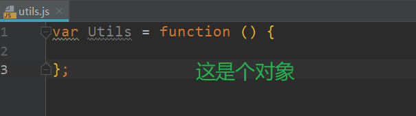

Vue


soc 关注度分离原则

事件分发机制

---

前端：

1. 布局：html,css

2. 控件：按钮，下拉框
3. 事件：click
4. 通信（网络）


---

# 第一个 Vue 应用程序

+ 新建文件夹`hello-vue`


---

+ IDEA打开该文件夹

---


Vue.js 的核心是实现了 MVVM 模式，她扮演的角色就是 ViewModel 层，那么所谓的第一个应用程序就是展示她的 **数据绑定** 功能，操作流程如下：

## 1.创建一个 HTML 文件


```html
<!DOCTYPE html>
<html>
<head>
    <meta charset="UTF-8">
    <title>第一个 Vue 应用程序</title>
</head>
<body>
</body>
</html>
```

## 2.引入 Vue.js

```html
<script src="https://cdn.jsdelivr.net/npm/vue"></script>
```

## 3.创建一个 Vue 的实例

```html
<script type="text/javascript">
    var vm = new Vue({
        el: '#vue',
        data: {
            message: 'Hello Vue!'
        }
    });
</script>
```

说明

- `el:'#vue'`：绑定元素的 ID
- `data:{message:'Hello Vue!'}`：数据对象中有一个名为 `message` 的属性，并设置了初始值 `Hello Vue!`

## 4.将数据绑定到页面元素

```html
<div id="vue">    {{message}}</div>
```

说明：只需要在绑定的元素中使用 **双花括号** 将 Vue 创建的名为 `message` 属性包裹起来，即可实现数据绑定功能，也就实现了 ViewModel 层所需的效果，是不是和 `EL` 表达式非常像？

```html
#{message} => {{message}}
```

## 5.完整的 HTML

```html
<!DOCTYPE html>
<html>
<head>
    <meta charset="UTF-8">
    <title>第一个 Vue 应用程序</title>
    <script src="https://cdn.jsdelivr.net/npm/vue"></script>
</head>
<body>
    <div id="vue">
        {{message}}
    </div>
<script type="text/javascript">
    var vm = new Vue({
        el: '#vue',
        data: {
            message: 'Hello Vue!'
        }
    });
</script>
</body>
</html>
```

注：我是在 `IDEA` 上创建的 HTML，并使用 `IDEA` 内置的 HTTP 服务器运行

---


## 6.测试 Vue

为了能够更直观的体验 Vue 带来的数据绑定功能，我们需要在浏览器测试一番，操作流程如下：

- 在 `Chrome` 浏览器上运行第一个 Vue 应用程序，并按 `F12` 进入 **开发者工具**


- 在控制台输入 `vm.message = 'Hello World'` ，然后 **回车**，你会发现浏览器中显示的内容会直接变成 `Hello World`


---


---

# Vue 实例的生命周期

依赖倒置：依赖倒置原则（Dependence Inversion Principle）是程序要依赖于抽象接口，不要依赖于具体实现。简单的说就是要求对抽象进行编程，不要对实现进行编程，这样就降低了客户与实现模块间的耦合。


---


# Vue 语法

## 1条件判断语句

新建if.html


```html
<!DOCTYPE html>
<html>
<head>
    <meta charset="UTF-8">
    <title>语法篇 v-if</title>
    <script src="https://cdn.jsdelivr.net/npm/vue"></script>
</head>
<body>
<div id="vue">
    <h1 v-if="ok">YES</h1>
    <h1 v-else>NO</h1>
</div>
<script type="text/javascript">
    var vm = new Vue({
        el: '#vue',
        data: {
            ok: true
        }
    });
</script>
</body>
</html>
```


---

## 2.连续的条件判断语句

```html
<!DOCTYPE html>
<html>
<head>
    <meta charset="UTF-8">
    <title>语法篇 v-else-if</title>
    <script src="https://cdn.jsdelivr.net/npm/vue"></script>
</head>
<body>
<div id="vue">
    <h1 v-if="type === 'A'">A</h1>
    <h1 v-else-if="type === 'B'">B</h1>
    <h1 v-else-if="type === 'C'">C</h1>
    <h1 v-else>你看不见我</h1>
</div>
<script type="text/javascript">
    var vm = new Vue({
        el: '#vue',
        data: {
            type: 'A'
        }
    });
</script>
</body>
</html>
```


### 测试效果

- 在 `Chrome` 浏览器上运行，并按 `F12` 进入 `开发者工具`


- 分别观察在控制台输入 `vm.type = 'B'、'C'、'D'` 的变化


---

## 3.循环遍历语句

```html
<!DOCTYPE html>
<html>
<head>
    <meta charset="UTF-8">
    <title>语法篇 v-for</title>
    <script src="https://cdn.jsdelivr.net/npm/vue"></script>
</head>
<body>
<div id="vue">
    <li v-for="item in items">
        {{ item.message }}
    </li>
</div>
<script type="text/javascript">
    var vm = new Vue({
        el: '#vue',
        data: {
            items: [
                {message: '鬼灭之刃'},
                {message: '一拳超人'},
                {message: '我们无法一起学习'}
            ]
        }
    });
</script>
</body>
</html>
```


```
vm.items.push({message: '少年歌行'})
```


---

# Vue 事件


```java
<!DOCTYPE html>
<html xmlns:v-on="">
<head>
    <meta charset="UTF-8">
    <title>事件篇 v-on</title>
    <script src="https://cdn.jsdelivr.net/npm/vue"></script>
</head>
<body>
<div id="vue">
    <button v-on:click="sayHi">点我</button>
</div>
<script type="text/javascript">
    var vm = new Vue({
        el: '#vue',
        data: {
            message: 'Hello World'
        },
        // 在 `methods` 对象中定义方法
        methods: {
            sayHi: function (event) {
                // `this` 在方法里指向当前 Vue 实例
                alert(this.message);
            }
        }
    });
</script>
</body>
</html>
```


---

# Vue 通信

[axios中文文档](http://www.axios-js.com/zh-cn/docs/)


---data.json

```json
{
  "name": "广州千锋",
  "url": "http://www.funtl.com",
  "page": 88,
  "isNonProfit": true,
  "address": {
    "street": "元岗路.",
    "city": "广东广州",
    "country": "中国"
  },
  "links": [
    {
      "name": "Google",
      "url": "http://www.google.com"
    },
    {
      "name": "Baidu",
      "url": "http://www.baidu.com"
    },
    {
      "name": "SoSo",
      "url": "http://www.SoSo.com"
    }
  ]
}
```

--axios.html

```html
<!DOCTYPE html>
<html>
<head>
    <meta charset="UTF-8">
    <title>网络篇 Axios</title>
    <script src="https://cdn.jsdelivr.net/npm/vue"></script>
    <script src="https://unpkg.com/axios/dist/axios.min.js"></script>
</head>
<body>
<div id="vue">
    <div>名称：{{info.name}}</div>
    <div>地址：{{info.address.country}}-{{info.address.city}}-{{info.address.street}}</div>
    <div>链接：<a v-bind:href="info.url" target="_blank">{{info.url}}</a> </div>
</div>
<script type="text/javascript">
    var vm = new Vue({
        el: '#vue',
        data() {
            return {
                info: {
                    name: null,
                    address: {
                        country: null,
                        city: null,
                        street: null
                    },
                    url: null
                }
            }
        },
        mounted() {
            axios
                .get('data.json')
                .then(response => (this.info = response.data));
        }
    });
</script>
</body>
</html>
```

---


---

# JS函数对象


## 1.utils.js

```javascript
// 函数对象
var Utils = function () {

    //私有属性
    var username;

    //私有方法
    var setUsername = function (username) {

        this.username = username;

    };

    var getUsername = function () {

        return this.username;
    };


    return {

        //公共方法
        setUsername: function (username) {

            setUsername(username)

        },

        getUsername: function () {

            return getUsername();
        }
    }
}();
```




## 2.index.html

```html
<!DOCTYPE html>
<html lang="en">
<head>
    <meta charset="UTF-8">
    <title>Title</title>
</head>
<body>

<button onclick="sayHi()">测试</button>

<script src="utils.js"></script>
<script type="text/javascript">
    function sayHi() {
        Utils.setUsername("老王")
        alert(Utils.getUsername())
    }
</script>
</body>
</html>
```

---


---

# Vue 通信二

从spring boot接受json数据


--User

```java
package com.junle.springboot.axios.domain;

import java.io.Serializable;

public class User implements Serializable {

    private String username;

    public String getUsername() {
        return username;
    }

    public void setUsername(String username) {
        this.username = username;
    }
}

```

--UserController

```java
package com.junle.springboot.axios.controller;

import com.junle.springboot.axios.domain.User;
import org.springframework.web.bind.annotation.GetMapping;
import org.springframework.web.bind.annotation.RestController;

@RestController
public class UserController {

    @GetMapping(value = "/user")
    public User user() {
        User user = new User();
        user.setUsername("小王");

        return user;
    }
}

```

---

启动

```
http://localhost:8080/user
```


---


axios.html

```java
<!DOCTYPE html>
<html>
<head>
    <meta charset="UTF-8">
    <title>网络篇 Axios</title>
    <script src="https://cdn.jsdelivr.net/npm/vue"></script>
    <script src="https://unpkg.com/axios/dist/axios.min.js"></script>
</head>
<body>
<div id="vue">

    <ul>
        <li>姓名：{{user.username}}</li>
    </ul>
</div>
<script type="text/javascript">
    var vm = new Vue({
        el: '#vue',
        data() {
            return {
                user: {
                   username: ""
                }
            }
        },
        mounted() {
            axios
                .get('http://localhost:8080/user')
                .then(response => (this.user = response.data));
        }
    });
</script>
</body>
</html>
```


---

解决跨域问题

```java
@CrossOrigin("*")
```


---


# Vue 表单输入

--form.html

```html
<!DOCTYPE html>
<html>
<head>
    <meta charset="UTF-8">
    <title>双向绑定</title>
    <script src="https://cdn.jsdelivr.net/npm/vue"></script>
</head>
<body>
<div id="vue">
    <input type="text" v-model="message"/> 当行文本：{{message}}
</div>
<script type="text/javascript">
    var vm = new Vue({
        el: '#vue',
        data: {
            message: "Hello Vue"
        }
    });
</script>
</body>
</html>
```


---

# Vue 组件基础


## 1.使用 `Vue.component()` 方法注册组件

--`component`

```html
<!DOCTYPE html>
<html>
<head>
    <meta charset="UTF-8">
    <title># Vue 组件基础</title>
    <script src="https://cdn.jsdelivr.net/npm/vue"></script>
</head>
<body>
<div id="vue">
    <ul>
        <my-li></my-li>
    </ul>
</div>
<script type="text/javascript">
    Vue.component(
        "my-li",{
            template: "<li>Hello</li>"
        }
    );
    var vm = new Vue({
        el: '#vue'
    });
</script>
</body>
</html>
```


```html
<!DOCTYPE html>
<html>
<head>
    <meta charset="UTF-8">
    <title># Vue 组件基础</title>
    <script src="https://cdn.jsdelivr.net/npm/vue"></script>
</head>
<body>
<div id="vue">
    <ul>
        <my-li></my-li>
    </ul>
</div>
<script type="text/javascript">
    Vue.component(
        "my-li",{
            template: "<li style='color: red'>Hello</li>"
        }
    );
    var vm = new Vue({
        el: '#vue'
    });
</script>
</body>
</html>
```


---

## 2.使用 `props` 属性传递参数

--props.html

```html
<!DOCTYPE html>
<html>
<head>
    <meta charset="UTF-8">
    <title>使用 props 属性传递参数</title>
    <script src="https://cdn.jsdelivr.net/npm/vue"></script>
</head>
<body>
<div id="vue">
    <ul>
        <my-li v-for="name in names" v-bind:name="name"></my-li>
    </ul>
</div>
<script type="text/javascript">
    Vue.component(
        "my-li",{
            props: ['name'],
            template: "<li style='color: red'>{{name}}</li>"
        }
    );
    var vm = new Vue({
        el: '#vue',
        data: {
            names: ["jungle","junglegod","junglegodlion"]
        }
    });
</script>
</body>
</html>
```


---

# Vue 计算属性

--computed.html

```html
<!DOCTYPE html>
<html lang="en">
<head>
    <meta charset="UTF-8">
    <title>计算属性</title>
    <script src="https://cdn.jsdelivr.net/npm/vue"></script>
</head>
<body>
<div id="vue">
 <div>获取当前时间的方法：{{getCurrentTime1()}}</div>
 <div>获取当前时间的属性：{{getCurrentTime2}}</div>
</div>
<script type="text/javascript">
    var vm = new Vue({
        el: '#vue',
        methods: {
            getCurrentTime1: function () {
                return Date.now();
            }
        },
        computed: {
            getCurrentTime2: function () {
                return Date.now();
            }
        }
    });
</script>
</body>
</html>
```


---


# Vue 内容分发与自定义事件

## 1.插槽

--slot.html

```java
<!DOCTYPE html>
<html lang="en">
<head>
    <meta charset="UTF-8">
    <title>Vue 内容分发与自定义事件</title>
    <script src="https://cdn.jsdelivr.net/npm/vue"></script>
</head>
<body>
<div id="vue">
 <todo>
     <todo-title slot="todo-title"></todo-title>
     <todo-items slot="todo-items"></todo-items>
 </todo>
</div>
<script type="text/javascript">
    Vue.component(
        "todo",{
            template: "<div>\
                           <slot name='todo-title'></slot>\
                            <ul>\
                                 <slot name='todo-items'></slot>\
                            </ul>\
                       </div>\
                            "
        }
    );
    Vue.component(
       "todo-title",{
           template: "<h1>待办事项</h1>"
        }
    );
    Vue.component(
        "todo-items",{
            template: "<li>待办列表</li>"
        }
    );

    var vm = new Vue({
        el: '#vue'
    });
</script>
</body>
</html>
```


---

## 2.传值

--slot2.html

```html
<!DOCTYPE html>
<html lang="en">
<head>
    <meta charset="UTF-8">
    <title>Vue 内容分发与自定义事件</title>
    <script src="https://cdn.jsdelivr.net/npm/vue"></script>
</head>
<body>
<div id="vue">
 <todo>
     <todo-title slot="todo-title" v-bind:title="title"></todo-title>
     <todo-items slot="todo-items" v-for="item in items" v-bind:item="item"></todo-items>
 </todo>
</div>
<script type="text/javascript">
    Vue.component(
        "todo",{
            template: "<div>\
                           <slot name='todo-title'></slot>\
                            <ul>\
                                 <slot name='todo-items'></slot>\
                            </ul>\
                       </div>\
                            "
        }
    );
    Vue.component(
       "todo-title",{
           props: ["title"],
           template: "<h1>{{title}}</h1>"
        }
    );
    Vue.component(
        "todo-items",{
            props: ["item"],
            template: "<li>{{item}}</li>"
        }
    );

    var vm = new Vue({
        el: '#vue',
        data: {
            title: "最新动漫",
            items: [
                "鬼灭之刃",
                "少年歌行",
                "一人之下"
            ]
        }
    });
</script>
</body>
</html>
```


---

## 3.绑定事件

--slot3.html

```java
<!DOCTYPE html>
<html lang="en">
<head>
    <meta charset="UTF-8">
    <title>Vue 内容分发与自定义事件</title>
    <script src="https://cdn.jsdelivr.net/npm/vue"></script>
</head>
<body>
<div id="vue">
 <todo>
     <todo-title slot="todo-title" v-bind:title="title"></todo-title>
     <todo-items slot="todo-items" v-for="(item,index) in items" v-bind:item="item" v-bind:index="index" v-on:remove="removeItems(index)"></todo-items>
 </todo>
</div>
<script type="text/javascript">
    Vue.component(
        "todo",{
            template: "<div>\
                           <slot name='todo-title'></slot>\
                            <ul>\
                                 <slot name='todo-items'></slot>\
                            </ul>\
                       </div>\
                            "
        }
    );
    Vue.component(
       "todo-title",{
           props: ["title"],
           template: "<h1>{{title}}</h1>"
        }
    );
    Vue.component(
        "todo-items",{
            props: ["item","index"],
            template: "<li>{{index + 1}}.{{item}} <button @click='remove(index)'>删除</button></li>",
            methods: {
                remove: function (index) {
                    this.$emit("remove",index)
                }
            }

        }
    );

    var vm = new Vue({
        el: '#vue',
        data: {
            title: "最新动漫",
            items: [
                "鬼灭之刃",
                "少年歌行",
                "一人之下"
            ]
        },
        methods: {
            removeItems: function (index) {
               this.items.splice(index,1);
            }
        }
    });
</script>
</body>
</html>
```

this.$emit("需要发射到Vue实例中的方法名",...对应的方法参数),其中这里的this指的是对应的Vue组件实例。

---


---

# VueCli

## 1.安装 vue-cli

```shell
npm install vue-cli -g --registry=https://registry.npm.taobao.org
# 输出如下
npm WARN deprecated coffee-script@1.12.7: CoffeeScript on NPM has moved to "coffeescript" (no hyphen)
C:\Users\Administrator\AppData\Roaming\npm\vue -> C:\Users\Administrator\AppData\Roaming\npm\node_modules\vue-cli\bin\vue
C:\Users\Administrator\AppData\Roaming\npm\vue-init -> C:\Users\Administrator\AppData\Roaming\npm\node_modules\vue-cli\bin\vue-init
C:\Users\Administrator\AppData\Roaming\npm\vue-list -> C:\Users\Administrator\AppData\Roaming\npm\node_modules\vue-cli\bin\vue-list
+ vue-cli@2.9.6
added 241 packages from 206 contributors in 24.481s
```

测试是否安装成功

```shell
# 查看可以基于哪些模板创建 vue 应用程序，通常我们选择 webpack
vue list
# 输出如下
Available official templates:
★  browserify - A full-featured Browserify + vueify setup with hot-reload, linting & unit testing.
★  browserify-simple - A simple Browserify + vueify setup for quick prototyping.
★  pwa - PWA template for vue-cli based on the webpack template
★  simple - The simplest possible Vue setup in a single HTML file
★  webpack - A full-featured Webpack + vue-loader setup with hot reload, linting, testing & css extraction.
★  webpack-simple - A simple Webpack + vue-loader setup for quick prototyping.
```


## 2.第一个 vue-cli 应用程序

**创建一个基于 webpack 模板的 vue 应用程序**

```shell
# 这里的 hello-vue-cli 是项目名称，可以根据自己的需求起名
vue init webpack hello-vue-cli
# 输出如下
? Project name hello-vue-cli
? Project description A Vue.js project
? Author Lusifer <topsale@vip.qq.com>
? Vue build standalone
? Install vue-router? No
? Use ESLint to lint your code? No
? Set up unit tests No
? Setup e2e tests with Nightwatch? No
? Should we run `npm install` for you after the project has been created? (recommended) no
   vue-cli · Generated "hello-vue-cli".
# Project initialization finished!
# ========================
To get started:
  cd hello-vue-cli
  npm install (or if using yarn: yarn)
  npm run dev
Documentation can be found at https://vuejs-templates.github.io/webpack
```

**说明**

- `Project name`：项目名称，默认 `回车` 即可
- `Project description`：项目描述，默认 `回车` 即可
- `Author`：项目作者，默认 `回车` 即可
- `Install vue-router`：是否安装 `vue-router`，选择 `n` 不安装（后期需要再手动添加）
- `Use ESLint to lint your code`：是否使用 `ESLint` 做代码检查，选择 `n` 不安装（后期需要再手动添加）
- `Set up unit tests`：单元测试相关，选择 `n` 不安装（后期需要再手动添加）
- `Setup e2e tests with Nightwatch`：单元测试相关，选择 `n` 不安装（后期需要再手动添加）
- `Should we run npm install for you after the project has been created`：创建完成后直接初始化，选择 `n`，我们手动执行

---

## 3.初始化并运行

```shell
# 初始化
cd hello-vue-cli
npm install --registry=https://registry.npm.taobao.org
# 输出如下
npm WARN deprecated browserslist@2.11.3: Browserslist 2 could fail on reading Browserslist >3.0 config used in other tools.
npm WARN deprecated bfj-node4@5.3.1: Switch to the `bfj` package for fixes and new features!
npm WARN deprecated browserslist@1.7.7: Browserslist 2 could fail on reading Browserslist >3.0 config used in other tools.
> core-js@2.6.9 postinstall D:\Workspace\Study\other\hello-vue-cli\node_modules\core-js
> node scripts/postinstall || echo "ignore"
Thank you for using core-js ( https://github.com/zloirock/core-js ) for polyfilling JavaScript standard library!
The project needs your help! Please consider supporting of core-js on Open Collective or Patreon:
> https://opencollective.com/core-js
> https://www.patreon.com/zloirock
Also, the author of core-js ( https://github.com/zloirock ) is looking for a good job -)
> uglifyjs-webpack-plugin@0.4.6 postinstall D:\Workspace\Study\other\hello-vue-cli\node_modules\webpack\node_modules\uglifyjs-webpack-plugin
> node lib/post_install.js
npm notice created a lockfile as package-lock.json. You should commit this file.
npm WARN ajv-keywords@3.4.1 requires a peer of ajv@^6.9.1 but none is installed. You must install peer dependencies yourself.
npm WARN optional SKIPPING OPTIONAL DEPENDENCY: fsevents@1.2.9 (node_modules\fsevents):
npm WARN notsup SKIPPING OPTIONAL DEPENDENCY: Unsupported platform for fsevents@1.2.9: wanted {"os":"darwin","arch":"any"} (current: {"os":"win32","arch":"x64"})
added 1207 packages from 667 contributors and audited 11765 packages in 81.571s
found 10 vulnerabilities (6 moderate, 4 high)
  run `npm audit fix` to fix them, or `npm audit` for details
# 运行
npm run dev
# 输出如下
 DONE  Compiled successfully in 3226ms                                   
 I  Your application is running here: http://localhost:8080
```

安装并运行成功后在浏览器输入：[http://localhost:8080](http://localhost:8080)

---

## 4.目录结构

- `build` 和 `config`：WebPack 配置文件
- `node_modules`：用于存放 `npm install` 安装的依赖文件
- `src`：项目源码目录
- `static`：静态资源文件
- `.babelrc`：Babel 配置文件，主要作用是将 ES6 转换为 ES5
- `.editorconfig`：编辑器配置
- `eslintignore`：需要忽略的语法检查配置文件
- `.gitignore`：git 忽略的配置文件
- `.postcssrc.js`：css 相关配置文件，其中内部的 `module.exports` 是 NodeJS 模块化语法
- `index.html`：首页，仅作为模板页，实际开发时不使用
- package.json：项目的配置文件
  - `name`：项目名称
  - `version`：项目版本
  - `description`：项目描述
  - `author`：项目作者
  - `scripts`：封装常用命令
  - `dependencies`：生产环境依赖
  - `devDependencies`：开发环境依赖

---

## 5.源码目录

```shell
│  App.vue
│  main.js
│
├─assets
│      logo.png
│
└─components
        HelloWorld.vue
```

### main.js

项目的入口文件，我们知道所有的程序都会有一个入口

```js
// The Vue build version to load with the `import` command
// (runtime-only or standalone) has been set in webpack.base.conf with an alias.
import Vue from 'vue'
import App from './App'
Vue.config.productionTip = false
/* eslint-disable no-new */
new Vue({
  el: '#app',
  components: { App },
  template: '<App/>'
})
```

- `import Vue from 'vue'`：ES6 写法，会被转换成 `require("vue");` （require 是 NodeJS 提供的模块加载器）
- `import App from './App'`：意思同上，但是指定了查找路径，`./` 为当前目录
- `Vue.config.productionTip = false`：关闭浏览器控制台关于环境的相关提示
- new Vue({...})：实例化 Vue
  - `el: '#app'`：查找 index.html 中 id 为 app 的元素
  - `template: '<App/>'`：模板，会将 index.html 中 `<div id="app"></div>`替换为 `<App />`
  - `components: { App }`：引入组件，使用的是 `import App from './App'` 定义的 App 组件

### App.vue

组件模板

```js
<template>
  <div id="app">
    
    <HelloWorld/>
  </div>
</template>
<script>
import HelloWorld from './components/HelloWorld'
export default {
  name: 'App',
  components: {
    HelloWorld
  }
}
</script>
<style>
#app {
  <!-- 字体 -->
  font-family: 'Avenir', Helvetica, Arial, sans-serif;
  <!-- 文字平滑效果 -->
  -webkit-font-smoothing: antialiased;
  -moz-osx-font-smoothing: grayscale;
  text-align: center;
  color: #2c3e50;
  margin-top: 60px;
}
</style>
```

- `template`：HTML 代码模板，会替换 `` 中的内容
- `import HelloWorld from './components/HelloWorld'`：引入 HelloWorld 组件，用于替换 `template` 中的 ``
- export default{...}：导出 NodeJS 对象，作用是可以通过import关键字导入
  - `name: 'App'`：定义组件的名称
  - `components: { HelloWorld }`：定义子组件

---

### HelloWorld.vue

基本同上，不解释..

关于 `<style scoped>` 的说明：CSS 样式仅在当前组件有效，声明了样式的作用域

----

# VueRouter 第一个路由

## 1.安装

vue-router 是一个插件包，所以我们还是需要用 npm/cnpm 来进行安装的。打开命令行工具，进入你的项目目录，输入下面命令。

```shell
npm install vue-router --save-dev --registry=https://registry.npm.taobao.org
# 输出如下
npm WARN ajv-keywords@3.4.1 requires a peer of ajv@^6.9.1 but none is installed. You must install peer dependencies yourself.
npm WARN optional SKIPPING OPTIONAL DEPENDENCY: fsevents@1.2.9 (node_modules\fsevents):
npm WARN notsup SKIPPING OPTIONAL DEPENDENCY: Unsupported platform for fsevents@1.2.9: wanted {"os":"darwin","arch":"any"} (current: {"os":"win32","arch":"x64"})
+ vue-router@3.0.7
added 1 package from 1 contributor and audited 11766 packages in 11.33s
found 10 vulnerabilities (6 moderate, 4 high)
  run `npm audit fix` to fix them, or `npm audit` for details
```

如果在一个模块化工程中使用它，必须要通过 `Vue.use()` 明确地安装路由功能：

```js
import Vue from 'vue'
import VueRouter from 'vue-router'
Vue.use(VueRouter);
```

## 2.使用

案例在 hello-vue-cli 项目中使用 vue-router

首先，先删除`src/components` 的目录下的HelloWorld.vue

### 创建组件页面

创建一个名为 `src/components` 的目录专门放置我们开发的 Vue 组件，在 `src/components` 目录下创建一个名为 `Content.vue` 的组件，代码如下：

```vue
<template>
    <div>
      我是内容页
    </div>
</template>
<script>
    export default {
        name: "Content"
    }
</script>
<style>
  #app {
    font-family: 'Avenir', Helvetica, Arial, sans-serif;
    -webkit-font-smoothing: antialiased;
    -moz-osx-font-smoothing: grayscale;
    text-align: center;
    color: #2c3e50;
    margin-top: 60px;
  }
</style>
```


---

### 安装路由

创建一个名为 `src/router` 的目录专门放置我们的路由配置代码，在 `src/router` 目录下创建一个名为 `index.js` 路由配置文件，代码如下：

```js
import Vue from 'vue'
// 导入路由插件
import Router from 'vue-router'
// 导入上面定义的组件
// @代表src
import Content from '@/components/Content'
// 安装路由
Vue.use(Router);
// 配置路由
export default new Router({
  routes: [
    {
      // 路由路径
      path: '/content',
      // 路由名称
      name: 'Content',
      // 跳转到组件
      component: Content
    }
  ]
});

```

### 配置路由

修改 `main.js` 入口文件，增加配置路由的相关代码

```js
import Vue from 'vue'
import App from './App'
// 导入上面创建的路由配置目录
import router from './router'
Vue.config.productionTip = false;
new Vue({
  el: '#app',
  // 配置路由
  router,
  components: { App },
  template: '<App/>'
});
```

### 使用路由

修改 `App.vue` 组件，代码如下：

```js
<template>
  <div id="app">
    <router-link to="/">首页</router-link>
    <router-link to="/content">内容</router-link>
    <router-view></router-view>
  </div>
</template>
<script>
export default {
  name: 'App'
}
</script>
<style>
  #app {
    font-family: 'Avenir', Helvetica, Arial, sans-serif;
    -webkit-font-smoothing: antialiased;
    -moz-osx-font-smoothing: grayscale;
    text-align: center;
    color: #2c3e50;
    margin-top: 60px;
  }
</style>
```

说明：

- **router-link：** 默认会被渲染成一个 `` 标签，`to` 属性为指定链接
- **router-view：** 用于渲染路由匹配到的组件

---

### 效果演示


---

# VueRouter 第一个工程

## 1.概述

我们结合 [**ElementUI**](http://www.qfdmy.com/wp-content/themes/quanbaike/go.php?url=aHR0cDovL2VsZW1lbnQtY24uZWxlbWUuaW8vIy96aC1DTg==) 组件库，将所需知识点应用到实际中，以最快速度带领大家掌握 Vue 的使用

## 2.创建工程

创建一个名为 `hello-vue-element` 的工程

```shell
# 使用 webpack 打包工具初始化一个名为 hello-vue-element 的工程
vue init webpack hello-vue-element
```


## 3.安装依赖

我们需要安装 `vue-router`、`element-ui`、`sass-loader` 和 `node-sass` 四个插件

```shell
# 进入工程目录
cd hello-vue-element
# 安装 vue-router
npm install vue-router --save-dev --registry=https://registry.npm.taobao.org
# 安装 element-ui
npm i element-ui -S --registry=https://registry.npm.taobao.org
# 安装 SASS 加载器
npm install sass-loader node-sass --save-dev --registry=https://registry.npm.taobao.org
```

```shell
# 安装依赖
npm install --registry=https://registry.npm.taobao.org
```

## 4.第一个 ElementUI 页面

用IDEA打开


### 目录结构

新建文件夹`views`，`router`

在源码目录中创建如下结构：

- `assets`：用于存放资源文件
- `components`：用于存放 Vue 功能组件
- `views`：用于存放 Vue 视图组件
- `router`：用于存放 vue-router 配置


### 引入ElementUI 

修改 `main.js` 入口代码

```js
// The Vue build version to load with the `import` command
// (runtime-only or standalone) has been set in webpack.base.conf with an alias.
import Vue from 'vue'
import App from './App'

// 导入 ElementUI
import ElementUI from 'element-ui'
import 'element-ui/lib/theme-chalk/index.css'

Vue.config.productionTip = false

// 安装 ElementUI
Vue.use(ElementUI);

/* eslint-disable no-new */
new Vue({
  el: '#app',
  components: { App },
  template: '<App/>',
  // 启用 ElementUI
  render: h => h(App)
})

```

---

### 创建首页视图

在 `views` 目录下创建一个名为 `Main.vue` 的视图组件；该组件在当前章节无任何作用，主要用于登录后展示登录成功的跳转效果；

```vue
<template>
    <div>
      首页
    </div>
</template>
<script>
    export default {
        name: "Main"
    }
</script>
<style scoped>
</style>
```

### 创建登录页视图

在 `views` 目录下创建一个名为 `Login.vue` 的视图组件，其中 `el-*` 的元素为 ElementUI 组件；

```vue
<template>
    <div>
      我是登录
    </div>
</template>

<script>
    export default {
        name: "Login.vue"
    }
</script>

<style scoped>

</style>

```


### 创建路由

在 `router` 目录下创建一个名为 `index.js` 的 vue-router 路由配置文件

```js
import Vue from 'vue'
import Router from 'vue-router'
import Login from "../views/Login"
import Main from '../views/Main'
Vue.use(Router);
export default new Router({
  routes: [
    {
      // 登录页
      path: '/login',
      name: 'Login',
      component: Login
    },
    {
      // 首页
      path: '/main',
      name: 'Main',
      component: Main
    }
  ]
});
```

### 配置路由

修改 `main.js` 入口代码

```js
// The Vue build version to load with the `import` command
// (runtime-only or standalone) has been set in webpack.base.conf with an alias.
import Vue from 'vue'
import App from './App'
import router from './router'

// 导入 ElementUI
import ElementUI from 'element-ui'
import 'element-ui/lib/theme-chalk/index.css'

Vue.config.productionTip = false

// 安装 ElementUI
Vue.use(ElementUI);

/* eslint-disable no-new */
new Vue({
  el: '#app',
  components: { App },
  template: '<App/>',
  router,
  // 启用 ElementUI
  render: h => h(App)
})

```

### 测试

```
npm run dev
```

```
http://localhost:8080
```


```
http://localhost:8080/#/login
```


修改App.vue

```vue
<template>
  <div id="app">
    <router-view/>
  </div>
</template>

<script>

export default {
  name: 'App',

}
</script>

<style>
#app {
  font-family: 'Avenir', Helvetica, Arial, sans-serif;
  -webkit-font-smoothing: antialiased;
  -moz-osx-font-smoothing: grayscale;
  text-align: center;
  color: #2c3e50;
  margin-top: 60px;
}
</style>

```


----

再次访问


---

### 升级login页面

--Login.vue

```vue
<template>
    <div>

      <el-form ref="form" :model="form" :rules="rules" label-width="80px" class="login-box">
        <!--标题-->
        <h1 class="login-title">欢迎登录</h1>
        <el-form-item label="账号" prop="username">
          <el-input v-model="form.username"/>
        </el-form-item>
        <el-form-item label="密码" prop="password">
          <el-input type="password" v-model="form.password"/>
        </el-form-item>
        <el-form-item>
          <el-button type="primary" @click="login('form')">登录</el-button>
        </el-form-item>
      </el-form>

    </div>
</template>

<script>
    export default {
        name: "Login.vue",
      data() {
        return {
          form: {
            username: '',
            password: ''
          },

          // 表单验证，需要在 el-form-item 元素中增加 prop 属性
          rules: {
            username: [
              { required: true, message: '请输入账号', trigger: 'blur' },
            ],
            password: [
              { required: true, message: '请输入密码', trigger: 'blur' },
            ]
          }

        }
      },
      methods: {
          login: function (formName) {
            // 为表单绑定验证功能
            this.$refs[formName].validate((valid) => {
              if (valid) {
                // 跳转
                // 使用 vue-router 路由到指定页面，该方式称之为编程式导航
                this.$router.push("/main");
              } else {
                this.$message({
                  showClose: true,
                  message: '请输入账号密码',
                  type: 'error',
                  offset: 150
                });
                return false;
              }})


          }
      }
    }
</script>

<style scoped>

  /*设置标题样式*/
  .login-title {
    text-align: center;
  }

  /*设置登录框样式*/
  .login-box {
    /*登录文本向右偏移*/
    text-align: right;
    width: 400px;
    /*边框*/
    border: 1px solid #DCDFE6;
    /*居中*/
    margin: 0 auto;
    /*内边距*/
    padding: 20px 70px 20px 20px;
    /*登录框整体下移*/
    margin-top: 150px;
    /*给边框设置圆角*/
    border-radius: 10px;
    /*阴影效果,有立体的效果*/
    box-shadow: 0 0 20px;
  }
</style>

```

---

效果


----

# VueRouter 嵌套路由

嵌套路由又称子路由，在实际应用中，通常由多层嵌套的组件组合而成。同样地，URL 中各段动态路径也按某种结构对应嵌套的各层组件，例如：

```shell
/user/foo/profile                     /user/foo/posts
+------------------+                  +-----------------+
| User             |                  | User            |
| +--------------+ |                  | +-------------+ |
| | Profile      | |  +------------>  | | Posts       | |
| |              | |                  | |             | |
| +--------------+ |                  | +-------------+ |
+------------------+                  +-----------------+
```

---

[参考模板](https://element.eleme.cn/#/zh-CN/component/container)

## 1.创建嵌套视图组件

### 新增用户组件

在 `views/user` 目录下创建一个名为 `Add.vue` 的视图组件；该组件在当前章节无任何作用，主要用于展示嵌套效果；

```vue
<template>
    <div>
      新增用户
    </div>
</template>

<script>
    export default {
        name: "add"
    }
</script>

<style scoped>

</style>

```

### 用户列表组件

在 `views/user` 目录下创建一个名为 `List.vue` 的视图组件；该组件在当前章节无任何作用，主要用于展示嵌套效果；

```vue
<template>
    <div>
      用户列表
    </div>
</template>

<script>
    export default {
        name: "List"
    }
</script>

<style scoped>

</style>

```

## 2.配置嵌套路由

修改 `router` 目录下的 `index.js` 路由配置文件，代码如下：

```js
import Vue from 'vue'
import Router from 'vue-router'

import Login from "../views/Login"
import Main from '../views/Main'

import UserAdd from '@/views/user/Add'
import UserList from '@/views/user/List'


Vue.use(Router);
export default new Router({
  routes: [
    {
      // 登录页
      path: '/login',
      name: 'Login',
      component: Login
    },
    {
      // 首页
      path: '/main',
      name: 'Main',
      component: Main,
      // 配置嵌套路由
      children: [
        {name: 'UserAdd',path: '/user/add',component: UserAdd},
        {name: 'UserList',path: '/user/list',component: UserList},
      ]
    }
  ]
});

```

说明：主要在路由配置中增加了 `children` 数组配置，用于在该组件下设置嵌套路由

---

## 3.修改首页视图

接着上一节的代码，我们修改 `Main.vue` 视图组件，此处使用了 [ElementUI 布局容器组件](http://www.qfdmy.com/wp-content/themes/quanbaike/go.php?url=aHR0cDovL2VsZW1lbnQtY24uZWxlbWUuaW8vIy96aC1DTi9jb21wb25lbnQvY29udGFpbmVy)，代码如下：

```vue
<template>
  <div>
    <el-container style="height: 500px; border: 1px solid #eee">
      <el-aside width="200px" style="background-color: rgb(238, 241, 246)">
        <el-menu :default-openeds="['1','2']">
          <el-submenu index="1">
            <template slot="title"><i class="el-icon-message"></i>用户管理</template>
            <el-menu-item-group>
              <el-menu-item index="1-1"><router-link to="/user/add">新增用户</router-link> </el-menu-item>
              <el-menu-item index="1-2"><router-link to="/user/list">用户列表</router-link></el-menu-item>
            </el-menu-item-group>
          </el-submenu>
          <el-submenu index="2">
            <template slot="title"><i class="el-icon-menu"></i>商品管理</template>
            <el-menu-item-group>
              <el-menu-item index="2-1">新增商品</el-menu-item>
              <el-menu-item index="2-2">商品列表</el-menu-item>
            </el-menu-item-group>
          </el-submenu>
        </el-menu>
      </el-aside>

      <el-container>
        <el-header style="text-align: right; font-size: 12px">
          <el-dropdown>
            <i class="el-icon-setting" style="margin-right: 15px"></i>
            <el-dropdown-menu slot="dropdown">
              <el-dropdown-item>查看</el-dropdown-item>
              <el-dropdown-item>新增</el-dropdown-item>
              <el-dropdown-item>删除</el-dropdown-item>
            </el-dropdown-menu>
          </el-dropdown>
          <span>王小虎</span>
        </el-header>

        <el-main>

          <router-view/>
        </el-main>
      </el-container>
    </el-container>

  </div>
</template>
<script>
  export default {
    name: "Main",
    data() {
      const item = {
        date: '2016-05-02',
        name: '王小虎',
        address: '上海市普陀区金沙江路 1518 弄'
      };
      return {
        tableData: Array(20).fill(item)
      }
    }
  }
</script>
<style scoped>
  .el-header {
    background-color: #B3C0D1;
    color: #333;
    line-height: 60px;
  }

  .el-aside {
    color: #333;
  }
</style>

```

说明：

在 <el-main> 元素中配置了 <router-view /> 用于展示嵌套路由

主要使用 <router-link to="/user/add>个人信息</router-link> 展示嵌套路由内容

---

## 4.效果演示


---


# VueRouter 参数传递与重定向

## 1.使用路径匹配的方式

--index.js

```js
import Vue from 'vue'
import Router from 'vue-router'

import Login from "../views/Login"
import Main from '../views/Main'

import UserAdd from '@/views/user/Add'
import UserList from '@/views/user/List'


Vue.use(Router);
export default new Router({
  routes: [
    {
      // 登录页
      path: '/login',
      name: 'Login',
      component: Login
    },
    {
      // 首页
      path: '/main',
      name: 'Main',
      component: Main,
      // 配置嵌套路由
      children: [
        {name: 'UserAdd',path: '/user/add/:id',component: UserAdd},
        {name: 'UserList',path: '/user/list/:id',component: UserList,props: true},
      ]
    },
    {
      path: '/home',
      redirect: '/main'
    }
  ]
});

```


--Main.vue

```vue
<template>
  <div>
    <el-container style="height: 500px; border: 1px solid #eee">
      <el-aside width="200px" style="background-color: rgb(238, 241, 246)">
        <el-menu :default-openeds="['1','2']">
          <el-submenu index="1">
            <template slot="title"><i class="el-icon-message"></i>用户管理</template>
            <el-menu-item-group>
              <el-menu-item index="1-1"><router-link to="/user/add/1">新增用户</router-link> </el-menu-item>
              <el-menu-item index="1-2"><router-link to="/user/list/2">用户列表</router-link></el-menu-item>
            </el-menu-item-group>
          </el-submenu>
          <el-submenu index="2">
            <template slot="title"><i class="el-icon-menu"></i>商品管理</template>
            <el-menu-item-group>
              <el-menu-item index="2-1">新增商品</el-menu-item>
              <el-menu-item index="2-2">商品列表</el-menu-item>
            </el-menu-item-group>
          </el-submenu>
        </el-menu>
      </el-aside>

      <el-container>
        <el-header style="text-align: right; font-size: 12px">
          <el-dropdown>
            <i class="el-icon-setting" style="margin-right: 15px"></i>
            <el-dropdown-menu slot="dropdown">
              <el-dropdown-item>查看</el-dropdown-item>
              <el-dropdown-item>新增</el-dropdown-item>
              <el-dropdown-item>删除</el-dropdown-item>
              <el-dropdown-item ><router-link to="/home">首页</router-link></el-dropdown-item>
            </el-dropdown-menu>
          </el-dropdown>
          <span>王小虎</span>
        </el-header>

        <el-main>

          <router-view/>
        </el-main>
      </el-container>
    </el-container>

  </div>
</template>
<script>
  export default {
    name: "Main",
    data() {
      const item = {
        date: '2016-05-02',
        name: '王小虎',
        address: '上海市普陀区金沙江路 1518 弄'
      };
      return {
        tableData: Array(20).fill(item)
      }
    }
  }
</script>
<style scoped>
  .el-header {
    background-color: #B3C0D1;
    color: #333;
    line-height: 60px;
  }

  .el-aside {
    color: #333;
  }
</style>

```


--Add.vue

```vue
<template>
    <div>
      新增用户
      {{ $route.params.id }}
    </div>
</template>

<script>
    export default {
        name: "add"
    }
</script>

<style scoped>

</style>

```


效果展示


----


## 2.使用 props 的方式

--List.vue

```vue
<template>
    <div>
      用户列表
      {{id}}
    </div>
</template>

<script>
    export default {
      props: ["id"],
        name: "List"
    }
</script>

<style scoped>

</style>

```


--index.js

```js
import Vue from 'vue'
import Router from 'vue-router'

import Login from "../views/Login"
import Main from '../views/Main'

import UserAdd from '@/views/user/Add'
import UserList from '@/views/user/List'


Vue.use(Router);
export default new Router({
  routes: [
    {
      // 登录页
      path: '/login',
      name: 'Login',
      component: Login
    },
    {
      // 首页
      path: '/main',
      name: 'Main',
      component: Main,
      // 配置嵌套路由
      children: [
        {name: 'UserAdd',path: '/user/add/:id',component: UserAdd},
        {name: 'UserList',path: '/user/list/:id',component: UserList,props: true},
      ]
    },
    {
      path: '/home',
      redirect: '/main'
    }
  ]
});

```


--Main.vue

```vue
<template>
  <div>
    <el-container style="height: 500px; border: 1px solid #eee">
      <el-aside width="200px" style="background-color: rgb(238, 241, 246)">
        <el-menu :default-openeds="['1','2']">
          <el-submenu index="1">
            <template slot="title"><i class="el-icon-message"></i>用户管理</template>
            <el-menu-item-group>
              <el-menu-item index="1-1"><router-link to="/user/add/1">新增用户</router-link> </el-menu-item>
              <el-menu-item index="1-2"><router-link to="/user/list/2">用户列表</router-link></el-menu-item>
            </el-menu-item-group>
          </el-submenu>
          <el-submenu index="2">
            <template slot="title"><i class="el-icon-menu"></i>商品管理</template>
            <el-menu-item-group>
              <el-menu-item index="2-1">新增商品</el-menu-item>
              <el-menu-item index="2-2">商品列表</el-menu-item>
            </el-menu-item-group>
          </el-submenu>
        </el-menu>
      </el-aside>

      <el-container>
        <el-header style="text-align: right; font-size: 12px">
          <el-dropdown>
            <i class="el-icon-setting" style="margin-right: 15px"></i>
            <el-dropdown-menu slot="dropdown">
              <el-dropdown-item>查看</el-dropdown-item>
              <el-dropdown-item>新增</el-dropdown-item>
              <el-dropdown-item>删除</el-dropdown-item>
              <el-dropdown-item ><router-link to="/home">首页</router-link></el-dropdown-item>
            </el-dropdown-menu>
          </el-dropdown>
          <span>王小虎</span>
        </el-header>

        <el-main>

          <router-view/>
        </el-main>
      </el-container>
    </el-container>

  </div>
</template>
<script>
  export default {
    name: "Main",
    data() {
      const item = {
        date: '2016-05-02',
        name: '王小虎',
        address: '上海市普陀区金沙江路 1518 弄'
      };
      return {
        tableData: Array(20).fill(item)
      }
    }
  }
</script>
<style scoped>
  .el-header {
    background-color: #B3C0D1;
    color: #333;
    line-height: 60px;
  }

  .el-aside {
    color: #333;
  }
</style>

```


---


## 3.重定向

--index.js

```js
import Vue from 'vue'
import Router from 'vue-router'

import Login from "../views/Login"
import Main from '../views/Main'

import UserAdd from '@/views/user/Add'
import UserList from '@/views/user/List'


Vue.use(Router);
export default new Router({
  routes: [
    {
      // 登录页
      path: '/login',
      name: 'Login',
      component: Login
    },
    {
      // 首页
      path: '/main',
      name: 'Main',
      component: Main,
      // 配置嵌套路由
      children: [
        {name: 'UserAdd',path: '/user/add/:id',component: UserAdd},
        {name: 'UserList',path: '/user/list/:id',component: UserList,props: true},
      ]
    },
    {
      path: '/home',
      redirect: '/main'
    }
  ]
});

```


---

--Main.vue

```vue
<template>
  <div>
    <el-container style="height: 500px; border: 1px solid #eee">
      <el-aside width="200px" style="background-color: rgb(238, 241, 246)">
        <el-menu :default-openeds="['1','2']">
          <el-submenu index="1">
            <template slot="title"><i class="el-icon-message"></i>用户管理</template>
            <el-menu-item-group>
              <el-menu-item index="1-1"><router-link to="/user/add/1">新增用户</router-link> </el-menu-item>
              <el-menu-item index="1-2"><router-link to="/user/list/2">用户列表</router-link></el-menu-item>
            </el-menu-item-group>
          </el-submenu>
          <el-submenu index="2">
            <template slot="title"><i class="el-icon-menu"></i>商品管理</template>
            <el-menu-item-group>
              <el-menu-item index="2-1">新增商品</el-menu-item>
              <el-menu-item index="2-2">商品列表</el-menu-item>
            </el-menu-item-group>
          </el-submenu>
        </el-menu>
      </el-aside>

      <el-container>
        <el-header style="text-align: right; font-size: 12px">
          <el-dropdown>
            <i class="el-icon-setting" style="margin-right: 15px"></i>
            <el-dropdown-menu slot="dropdown">
              <el-dropdown-item>查看</el-dropdown-item>
              <el-dropdown-item>新增</el-dropdown-item>
              <el-dropdown-item>删除</el-dropdown-item>
              <el-dropdown-item ><router-link to="/home">首页</router-link></el-dropdown-item>
            </el-dropdown-menu>
          </el-dropdown>
          <span>王小虎</span>
        </el-header>

        <el-main>

          <router-view/>
        </el-main>
      </el-container>
    </el-container>

  </div>
</template>
<script>
  export default {
    name: "Main",
    data() {
      const item = {
        date: '2016-05-02',
        name: '王小虎',
        address: '上海市普陀区金沙江路 1518 弄'
      };
      return {
        tableData: Array(20).fill(item)
      }
    }
  }
</script>
<style scoped>
  .el-header {
    background-color: #B3C0D1;
    color: #333;
    line-height: 60px;
  }

  .el-aside {
    color: #333;
  }
</style>

```


效果演示


---

# VueRouter 路由模式与 404

## 1.路由模式

路由模式有两种

- hash：路径带 `#` 符号，如 `http://localhost/#/login`
- history：路径不带 `#` 符号，如 `http://localhost/login`

修改路由配置，代码如下：

--index.js

```js
export default new Router({
  mode: 'history',
  routes: [
  ]
});
```

---

## 2.处理 404

创建一个名为 `404.vue` 的视图组件，代码如下：

--404.vue

```vue
<template>
    <div>
      页面不存在
    </div>
</template>

<script>
    export default {
        name: "404"
    }
</script>

<style scoped>

</style>

```

--index.js

```js
import Vue from 'vue'
import Router from 'vue-router'

import Login from "../views/Login"
import Main from '../views/Main'

import UserAdd from '@/views/user/Add'
import UserList from '@/views/user/List'

import NotFound from '@/views/404'


Vue.use(Router);
export default new Router({
  routes: [
    {
      // 登录页
      path: '/login',
      name: 'Login',
      component: Login
    },
    {
      // 首页
      path: '/main',
      name: 'Main',
      component: Main,
      // 配置嵌套路由
      children: [
        {name: 'UserAdd',path: '/user/add/:id',component: UserAdd},
        {name: 'UserList',path: '/user/list/:id',component: UserList,props: true},
      ]
    },
    {
      path: '/home',
      redirect: '/main'
    },
    {
      path: '*',
      component: NotFound
    }
  ]
});

```

效果演示


---

# VueRouter 路由钩子与异步请求

在`static`文件夹新建`data.json`

```json
{
  "name": "广州千锋",
  "url": "http://www.funtl.com",
  "page": 88,
  "isNonProfit": true,
  "address": {
    "street": "元岗路.",
    "city": "广东广州",
    "country": "中国"
  },
  "links": [
    {
      "name": "Google",
      "url": "http://www.google.com"
    },
    {
      "name": "Baidu",
      "url": "http://www.baidu.com"
    },
    {
      "name": "SoSo",
      "url": "http://www.SoSo.com"
    }
  ]
}

```

---


--List.vue

```vue
<template>
    <div>
      用户列表
      {{id}}
    </div>
</template>

<script>
    export default {
      props: ["id"],
        name: "List",
      beforeRouteEnter: (to,from,next) =>{

        console.log("页面进入前");
        // 注意，一定要在 next 中请求，因为该方法调用时 Vue 实例还没有创建，
        // 此时无法获取到 this 对象，在这里使用官方提供的回调函数拿到当前实例
        next(vm => {
          vm.getData();
        });

    },
      beforeRouteLeave: (to,from,next) =>{

        console.log("页面离开前");
        next();

      },
      methods: {
        
        getData: function () {

          this.axios({
            type: 'get',
            url: 'http://localhost:8080/static/data.json'
          }).then(response => {
            console.log(response);
          }).catch(error => {
            console.log(error);
          })
          
        }
      }

    }
</script>

<style scoped>

</style>

```

---

安装 Axios

```shell
npm install axios -s --registry=https://registry.npm.taobao.org
```

引用 Axios

```js
import axios from 'axios'
// 原型链
Vue.prototype.axios = axios;
```


---


```
http://localhost:8080/static/data.json
```


---

效果演示


---

# Vuex 状态管理

## 1.概述

Vuex 是一个专为 Vue.js 应用程序开发的 **状态管理模式**。它采用集中式存储管理应用的所有组件的状态，并以相应的规则保证状态以一种可预测的方式发生变化。

---

## 2.安装

- 在项目根目录执行如下命令来安装 Vuex

```shell
npm install vuex --save --registry=https://registry.npm.taobao.org
```

- 修改 `main.js` 文件，导入 Vuex，关键代码如下：

```js
import Vuex from 'vuex'
Vue.use(Vuex);
```

## 3.状态管理

我们利用路由钩子 `beforeEach` 来判断用户是否登录，期间会用到 `sessionStorage` 存储功能

### 修改index.js

这里，路由模式需要需要使用history模式

--index.js

```js
export default new Router({
  mode: 'history',
  routes: [
  ]
});
```


### 修改Main.vue


### 修改 Login.vue

在表单验证成功方法内增加如下代码：

```vue
// 设置用户登录成功
sessionStorage.setItem('isLogin', 'true');
```


---

### 修改 main.js

利用路由钩子 `beforeEach` 方法判断用户是否成功登录，关键代码如下：

```js
// The Vue build version to load with the `import` command
// (runtime-only or standalone) has been set in webpack.base.conf with an alias.
import Vue from 'vue'
import App from './App'
import router from './router'

// 导入 ElementUI
import ElementUI from 'element-ui'
import 'element-ui/lib/theme-chalk/index.css'

import axios from 'axios'
// 原型链
Vue.prototype.axios = axios;

import Vuex from 'vuex'

Vue.config.productionTip = false

// 安装 ElementUI
Vue.use(ElementUI);

Vue.use(Vuex);

// 在跳转前执行
router.beforeEach((to, form, next) => {
  // 获取用户登录状态
  let isLogin = sessionStorage.getItem('isLogin');
  // 注销
  if (to.path == '/logout') {
    // 清空
    sessionStorage.clear();
    // 跳转到登录
    next({path: '/login'});
  }

  // 如果请求的是登录页
  else if (to.path == '/login') {
    if (isLogin == 'true') {
      // 跳转到首页

      next({path : '/main'});
    }
  }

  else if (isLogin == null) {
    next({path: "/login"})
  }

  // 下一个路由
  next();
});

/* eslint-disable no-new */
new Vue({
  el: '#app',
  components: { App },
  template: '<App/>',
  router,
  // 启用 ElementUI
  render: h => h(App)
})

```

效果


---

## 4.配置 Vuex

在 `src` 目录下创建一个名为 `store` 的目录并新建一个名为 `index.js` 文件用来配置 Vuex，代码如下：

```js
import Vue from 'vue'
import Vuex from 'vuex'
Vue.use(Vuex);
// 全局 state 对象，用于保存所有组件的公共数据
const state = {
  // 定义一个 user 对象
  // 在组件中是通过 this.$store.state.user 来获取
  user: {
    username: ''
  }
};
// 实时监听 state 值的最新状态，注意这里的 getters 可以理解为计算属性
const getters = {
  // 在组件中是通过 this.$store.getters.getUser 来获取
  getUser(state) {
    return state.user;
  }
};
// 定义改变 state 初始值的方法，这里是唯一可以改变 state 的地方，缺点是只能同步执行
const mutations = {
  // 在组件中是通过 this.$store.commit('updateUser', user); 方法来调用 mutations
  updateUser(state, user) {
    state.user = user;
  }
};
// 定义触发 mutations 里函数的方法，可以异步执行 mutations 里的函数
const actions = {
  // 在组件中是通过 this.$store.dispatch('asyncUpdateUser', user); 来调用 actions
  asyncUpdateUser(context, user) {
    context.commit('updateUser', user);
  }
};
export default new Vuex.Store({
  state,
  getters,
  mutations,
  actions
});
```

- 修改 `main.js` 增加刚才配置的 `store/index.js`，关键代码如下：

```js
import Vue from 'vue'
import Vuex from 'vuex'
import store from './store'
Vue.use(Vuex);
new Vue({
  el: '#app',
  store
});
```

---

--Login.vue

```vue
<template>
    <div>

      <el-form ref="form" :model="form" :rules="rules" label-width="80px" class="login-box">
        <!--标题-->
        <h1 class="login-title">欢迎登录</h1>
        <el-form-item label="账号" prop="username">
          <el-input v-model="form.username"/>
        </el-form-item>
        <el-form-item label="密码" prop="password">
          <el-input type="password" v-model="form.password"/>
        </el-form-item>
        <el-form-item>
          <el-button type="primary" @click="login('form')">登录</el-button>
        </el-form-item>
      </el-form>

    </div>
</template>

<script>
    export default {
        name: "Login.vue",
      data() {
        return {
          form: {
            username: '',
            password: ''
          },

          // 表单验证，需要在 el-form-item 元素中增加 prop 属性
          rules: {
            username: [
              { required: true, message: '请输入账号', trigger: 'blur' },
            ],
            password: [
              { required: true, message: '请输入密码', trigger: 'blur' },
            ]
          }

        }
      },
      methods: {
          login: function (formName) {
            // 为表单绑定验证功能
            this.$refs[formName].validate((valid) => {
              if (valid) {
                // 设置用户登录成功
                sessionStorage.setItem('isLogin', 'true');
                this.$store.dispatch("asyncUpdateUser",this.form)
                // 跳转
                // 使用 vue-router 路由到指定页面，该方式称之为编程式导航
                this.$router.push("/main");
              } else {
                this.$message({
                  showClose: true,
                  message: '请输入账号密码',
                  type: 'error',
                  offset: 150
                });
                return false;
              }})


          }
      }
    }
</script>

<style scoped>

  /*设置标题样式*/
  .login-title {
    text-align: center;
  }

  /*设置登录框样式*/
  .login-box {
    /*登录文本向右偏移*/
    text-align: right;
    width: 400px;
    /*边框*/
    border: 1px solid #DCDFE6;
    /*居中*/
    margin: 0 auto;
    /*内边距*/
    padding: 20px 70px 20px 20px;
    /*登录框整体下移*/
    margin-top: 150px;
    /*给边框设置圆角*/
    border-radius: 10px;
    /*阴影效果,有立体的效果*/
    box-shadow: 0 0 20px;
  }
</style>

```


--Main.vue


---


但刷新会消失

---

## 5.浏览器刷新 Vuex 数据消失

### 问题描述

Vuex 的状态存储是响应式的，当 Vue 组件从 store 中读取状态的时候，若 store 中的状态发生变化，那么相应的组件也会相应地得到高效更新。但是有一个问题就是：vuex 的存储的数据只是在页面的中，相当于我们定义的全局变量，刷新之后，里边的数据就会恢复到初始化状态。但是这个情况有时候并不是我们所希望的。

### 解决方案

监听页面是否刷新，如果页面刷新了，将 state 对象存入到 sessionStorage 中。页面打开之后，判断 sessionStorage 中是否存在 state 对象，如果存在，则说明页面是被刷新过的，将 sessionStorage 中存的数据取出来给 vuex 中的 state 赋值。如果不存在，说明是第一次打开，则取 vuex 中定义的 state 初始值。

### 修改代码

因为所有页面都走App.vue，所有

在 `App.vue` 中增加监听刷新事件

```vue
export default {
    name: 'App',
    mounted() {
      window.addEventListener('unload', this.saveState);
    },
    methods: {
      saveState() {
// sessionStorage中只能放字符串
        sessionStorage.setItem('state', JSON.stringify(this.$store.state));
      }
    }
  }
```

修改 `store/index.js` 中的 state

```js
const state = sessionStorage.getItem('state') ? JSON.parse(sessionStorage.getItem('state')) : {
  user: {
    username: ''
  }
};
```


---

## 6.模块化

由于使用单一状态树，应用的所有状态会集中到一个比较大的对象。当应用变得非常复杂时，store 对象就有可能变得相当臃肿。为了解决以上问题，Vuex 允许我们将 store 分割成模块（module）。每个模块拥有自己的 state、mutation、action、getter、甚至是嵌套子模块——从上至下进行同样方式的分割

### 创建 user 模块

在 `store` 目录下创建一个名为 `user` 的目录并创建一个名为 `User.js` 的文件，代码如下：

```js
const User = {
  // 因为模块化了，所以解决刷新问题的代码需要改造一下
  state: sessionStorage.getItem('userState') ? JSON.parse(sessionStorage.getItem('userState')) : {
    user: {
      username: ''
    }
  },
  getters: {
    getUser(state) {
      return state.user;
    }
  },
  mutations: {
    updateUser(state, user) {
      state.user = user;
    }
  },
  actions: {
    asyncUpdateUser(context, user) {
      context.commit('updateUser', user);
    }
  }
};
export default User;
```

### 修改 store/index.js

```js
import Vue from 'vue'
import Vuex from 'vuex'
import User from './user'
Vue.use(Vuex);
export default new Vuex.Store({
  modules: {
    // this.$store.state.user
    User
  }
});

```

> **备注：** 由于组件中使用的是 `getters` 和 `actions` 处理，所以调用代码不变

### 修改 App.vue

```VUE
<template>
  <div id="app">
    <router-view/>
  </div>
</template>

<script>

export default {
  name: 'App',
  mounted() {
    window.addEventListener('unload', this.saveState);
  },
  methods: {
    saveState() {
      // 模块化后，调用 state 的代码修改为 this.$store.state.user
      sessionStorage.setItem('userState', JSON.stringify(this.$store.state.User));
    }
  }
}
</script>

<style>
#app {
  font-family: 'Avenir', Helvetica, Arial, sans-serif;
  -webkit-font-smoothing: antialiased;
  -moz-osx-font-smoothing: grayscale;
  text-align: center;
  color: #2c3e50;
  margin-top: 60px;
}
</style>

```


---

